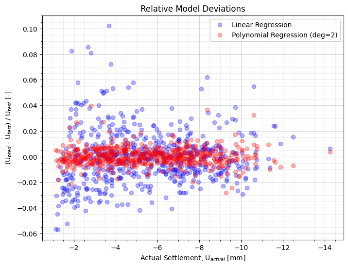

<h1>Foundation Response Predictor</h1> 
This repository contains material to predict foundations subgrade response during loading, in a plane strain condition.

It is based on ML models and results from FE models, automatically created by Plaxis 2D and Python.

The models will be deployed on my personal webpage and available by form.

<h3>Contents</h3>
<ul>
  <li><strong>Data Creation:</strong> Creates models via Python and Plaxis' REST API. Stores them as json</li>
  <li><strong>Feature Engineering:</strong> Loading, formatting and performing feature engineering on data inputs.</li>
  <li><strong>ML Models:</strong> Training linear, polynomial and deep learning models to predict foundations response during loading.</li>
  <li><strong>Plotting:</strong> Training linear, polynomial and deep learning models to predict foundations response during loading.</li>
</ul>

<h3>Tech Stack</h3>
<ul>
  <li>Python</li>
  <li>Plaxis 2D</li>
  <li>Pandas</li>
  <li>Scikit Learn</li>
  <li>Tensorflow</li>
</ul>

<h3>Example on Prediction</h3>

